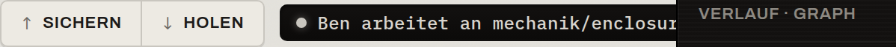

# Mehrbenutzer & Sync

Sobald mehr als eine Person an einem Produkt arbeitet, kommt ein **Server (Git-Remote)** ins
Spiel. Dieses Kapitel erklärt, wie das Werkzeug Zusammenarbeit *ohne* Datenverlust
ermöglicht.

## Wo die Daten liegen

- **Die App läuft lokal.** Sie braucht direkten Datei- und Git-Zugriff — eine reine
  Browser-Lösung könnte das nicht.
- **Die Cloud ist nur ein Remote.** Sie dient als Backup, Mehrgeräte-Abgleich und
  Austauschpunkt — **nie** als Dateiablage. Dein Produktordner gehört auf deine Platte, nicht
  in einen synchronisierten Cloud-Ordner.

> **⚠️ Server wird Pflicht, sobald geteilt wird**
>
> Das Sperren von Binärdateien wird serverseitig koordiniert. Darum braucht ein **geteiltes**
> Produkt zwingend einen Remote. Solo und ungeteilt funktioniert alles auch offline — sogar
> ganz ohne [Konto](Produkt-teilen#das-konto-app-weite-server-identitat).

## Manueller Sync: Sichern & Holen

Der Abgleich mit dem Server ist **bewusst und sichtbar** — zwei Tasten in der Werkbank-Leiste,
die du selbst drückst:

- **Sichern** (↑) — schiebt deine Arbeit (auch halbfertig) in dein **persönliches Backup** auf
  dem Server. Erreicht **nie** den geteilten Stand der anderen.
- **Holen** (↓) — holt den **geteilten Stand** der Kolleg:innen herein.

Daneben steht eine ruhige Statuszeile. Sie zeigt entweder, woran gerade jemand arbeitet
(**„{Name} arbeitet an {Datei}"**, hat Vorrang), oder den Abgleich-Status:

- **aktuell** — dein Stand entspricht dem geteilten Stand,
- **gesichert** — deine Arbeit wurde (privat) gesichert.

> **ℹ️ Der Auto-Commit bleibt still — der Sync ist manuell**
>
> Das *lokale* Speichern erzeugt weiterhin im Hintergrund automatisch Commits. Nur der
> *Netz-Abgleich* (Sichern/Holen) ist Handarbeit. So bestimmst du selbst, wann deine Arbeit
> das Backup bzw. den geteilten Stand erreicht.

## Sperren: Koordination für Binärdateien

Die entscheidende Achse im Team ist nicht Person-gegen-Person, sondern **mergebar vs. nicht
mergebar**:

| Eimer | Beispiele | Umgang |
|---|---|---|
| **Text, mergebar** | Firmware-Quellen, Doku, Text-BOM | Git führt zusammen |
| **Binär, unmergebar** | `.f3d`, STEP, STL, ZIP, Fotos | **Sperren** |
| **nominell Text, faktisch unmergebar** | KiCad-Quellen (`.kicad_sch`/`.kicad_pcb`) | wie Binär behandeln |

Für unmergebare Dateien gilt:

- Im Ruhezustand liegen sperrbare Binärdateien **schreibgeschützt** auf der Platte — das
  *ist* das sichtbare Signal: „read-only = frei, niemand dran".
- **Bearbeiten holt die Sperre.** Öffnest du so eine Datei zum Bearbeiten, holt das Werkzeug
  automatisch die Sperre — die Datei wird *für dich* beschreibbar.
- Für Kolleg:innen erscheint sie dann als **„gesperrt von X seit …"**.

Wer im Team gerade welche Binärdatei in Arbeit hat, zeigt das Panel rechts:

Auf der zugehörigen Artefakt-Karte leuchtet dann der **orange** Status-LED — der eine laute
Akzent. Eine Sperre ist reine **Koordination** („nicht gleichzeitig, sonst geht Arbeit
verloren"), **keine** Autorisierung („wer darf was"). Rollen und Rechte gibt es bewusst
nicht.

## Die zwei Push-Arten

Es gibt zwei scharf getrennte Arten, Arbeit auf den Server zu bringen:

- **Sicherung** *(privat)* — der **Sichern**-Knopf im Alltag. Spiegelt deine Zwischenstände
  (inkl. halbfertiger Binärdatei) in einen **persönlichen** Backup-Bereich. Backup ja,
  Freigabe nein. Gemeldet als **„gesichert"**.
- **Freigabe** *(öffentlich)* — gebunden an den **Freigabe-Toggle** einer Revision (siehe
  [Versionen & Revisionen](Versionen-und-Revisionen)). Bringt die *fertige* Binärdatei auf den geteilten
  Stand **und** gibt die Sperre frei („ich bin fertig damit"). Der Stand ist danach
  **veröffentlicht**.

Daraus folgt die tragende Sicherheitsregel:

> **Binär-Invariante**
>
> Eine gesperrte Binäränderung darf den geteilten Stand nicht erreichen, solange die Sperre
> gehalten wird.

Das macht gefährliche Merge-Situationen strukturell unmöglich: Was beim Holen je sichtbar
wird, ist bereits veröffentlicht — also bereits entsperrt — und der Abgleich berührt nur freie
Dateien. Eine vergessene Sperre heilt sich am nächsten Checkpoint selbst.

## „veröffentlicht": ein eigener, sichtbarer Zustand

Die **Sicherung** erreicht nur dein privates Backup. Ein Stand erreicht die **geteilte Linie**
ausschließlich über die **Freigabe** — und dabei wandert das Revisions-Etikett mit. Im
Versionsbaum trägt jeder Knoten daher ein binäres Abzeichen **„veröffentlicht"**: Es zeigt
ehrlich an, *ob* dieser Stand den Server erreicht hat.

Wichtig (und in der [Versionen-Seite](Versionen-und-Revisionen#drei-zustande-die-man-nicht-verwechseln-darf)
ausgeführt): „veröffentlicht" ist der **Ort** des Stands und unabhängig von der **Freigabe**
(der schreibgeschützten Revisions-Art). Ein Prototyp-Stand auf der geteilten Linie zeigt also
ebenfalls „veröffentlicht".

## Die laute Ausnahme

Es gibt **einen** Moment, in dem das Werkzeug die Stimme hebt: Wenn beim Holen (oder beim
Veröffentlichen) ein echter, nicht auflösbarer Widerspruch auftritt, hält das Werkzeug an und
fragt in **eigener** Sprache:

> „Dein und Bens Gehäuse-Stand widersprechen sich — welcher gilt?"
>
> [ mein Stand ] · [ Bens Stand ]

Du wählst, welcher Stand gilt; das Werkzeug schließt den Abgleich sauber ab. Das ist der
einzige orange umrahmte Augenblick der ganzen Oberfläche — er darf einen Merge-Konflikt jetzt
auch beim Namen nennen.

## Konto & Einrichtungs-Zeremonie

Zum Teilen brauchst du **einmalig** ein [Konto](Produkt-teilen#das-konto-app-weite-server-identitat)
— eine app-weite Server-Identität (Adresse + Zugangsdaten), die für alle Produkte gilt. Ein
Produkt zu teilen ist dann ein **einmaliger** Schritt pro Produkt (Server anbinden, erstmals
veröffentlichen, Kolleg:innen einladen). Den vollständigen Ablauf beschreibt
[Produkt teilen](Produkt-teilen).
