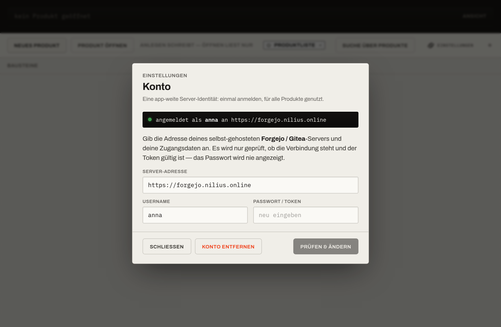

# Produkt teilen

Solange du allein arbeitest, braucht das Werkzeug keinen Server. Sobald ihr zu zweit oder
mehr an einem Produkt arbeitet, wird ein **Git-Remote** angebunden. Dazu richtest du
**einmal** ein Konto ein und führst dann pro Produkt eine kurze **Einrichtungs-Zeremonie**
durch.

## Das Konto (app-weite Server-Identität)

Es gibt genau **ein Konto** für die ganze App: eine **Server-Adresse** plus deine
**Zugangsdaten** (Username + Token), gültig für *alle* Produkte. Du meldest dich einmal an —
danach nutzt jede Server-Aktion diese Identität.

Das Konto öffnest du über das **Zahnrad** („Einstellungen") oben rechts in der Leiste:

- **Server-Adresse** — die Adresse deines selbst-gehosteten **Forgejo / Gitea**-Servers
  (z. B. `https://forgejo.nilius.online`).
- **Username** und **Passwort / Token** — deine Zugangsdaten. Das Passwort wird **nie**
  angezeigt und nur sicher im Schlüsselspeicher des Betriebssystems abgelegt.
- **Prüfen & Speichern** — testet die Verbindung und die Token-Gültigkeit (über
  `GET /api/v1/user`) und merkt sich deinen Kontonamen.

> **ℹ️ Was geprüft wird — und was nicht**
>
> Beim Speichern wird nur geprüft, ob die **Verbindung steht** und der **Token gültig** ist.
> Ob du auf dem Server *Repositories anlegen* darfst, wird **nicht** vorab geprüft — das
> zeigt sich ehrlich beim ersten Veröffentlichen (mit einer klaren Meldung, falls das Recht
> fehlt).

Mit **„Konto entfernen"** löschst du Adresse und Zugangsdaten wieder. Das rührt die bereits
eingerichteten Produkte **nicht** an — lokales Arbeiten läuft weiter, nur das Teilen pausiert.

> **💡 Lokales Arbeiten braucht kein Konto**
>
> Produkt anlegen, Bausteine wählen, arbeiten, Commits, Versionsbaum, Aufgaben, Suche — all
> das läuft **ohne** Konto. Es wird erst im **Teilen-Moment** gebraucht. Es gibt also keinen
> Login-Zwang beim Start.

## Die Einrichtungs-Zeremonie (einmalig pro Produkt)

Hast du ein Konto, führt die Zeremonie in **drei Schritten** durch — angestoßen über
**„Teilen einrichten"** in der Werkbank-Leiste:

#### 01 · Server anbinden

Du gibst nur noch das **Produkt-Ziel** an: optional einen **Besitzer / ein Team** (leer →
dein eigener Account) und den **Produkt-Namen** (z. B. `ember-reverb`). Die Server-Adresse und
die Zugangsdaten kommen aus deinem Konto. Dann **„Server anbinden"**.

#### 02 · Veröffentlichen

Der Server ist angebunden und die Sperren-Prüfung (`locksverify`) aktiv. Mit
**„Veröffentlichen"** bringst du das Produkt **einmalig** auf den Server.

#### 03 · Einladen

Das Produkt liegt jetzt auf dem Server. Du bekommst eine **Klon-Adresse**, die du
Kolleg:innen gibst — sie klonen das Produkt damit als eigene Kopie. Ab da gleicht ihr euch per
**Sichern** und **Holen** auf demselben Branch ab. Schließe mit **„Fertig"**.

Sobald ein Produkt geteilt ist, zeigt die Werkbank-Leiste ruhig den Status **„geteilt"**.

> **ℹ️ Warum hier Git-nähere Worte erlaubt sind**
>
> Das Teilen ist ein **seltener, einmaliger** Schritt pro Produkt. Anders als der tägliche
> Sync darf die Sprache hier näher an Git liegen — das ist Absicht.

## Der Alltag danach

Nach dem Einrichten läuft die Zusammenarbeit über den
[manuellen Sync](Mehrbenutzer-und-Sync#manueller-sync-sichern-holen):

- **Sichern** schiebt deine Arbeit in dein privates Backup, **Holen** bringt den geteilten
  Stand herein.
- Binärdateien werden über **Sperren** koordiniert; wer was in Arbeit hat, steht im
  „Fremde Sperren"-Panel und als Statuszeile **„{Name} arbeitet an {Datei}"**.
- Ein Stand erreicht die geteilte Linie über die **Freigabe** einer Revision und gilt dann
  als **veröffentlicht**.
- Nur bei einem echten, nicht auflösbaren Widerspruch hebt das Werkzeug die Stimme und fragt,
  **welcher Stand gilt**.

Das vollständige Modell steht unter [Mehrbenutzer & Sync](Mehrbenutzer-und-Sync).

> **⚠️ Server ist im Team Pflicht**
>
> Da Sperren serverseitig koordiniert werden, ist ein erreichbarer Remote für ein geteiltes
> Produkt zwingend. Fällt der Server aus, könnt ihr lokal weiterarbeiten, aber die
> Koordination ruht, bis er wieder erreichbar ist.
