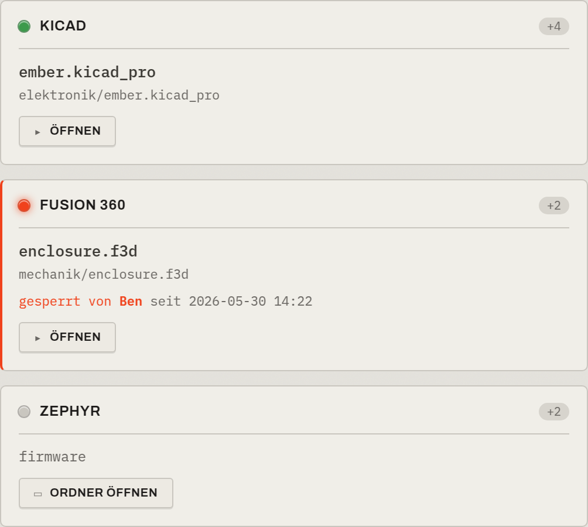

# Werkbank & Graph-Raum

Ein geöffnetes Produkt hat zwei gleichwertige, aber getrennte Räume. Die Trennung ist
bewusst — wie Git selbst zwischen „Jetzt arbeiten" und „Historie ansehen" trennt.

- Die **Werkbank** ist die *Vorderseite*: dein aktueller Arbeitszustand. Hier verbringst du
  den Alltag.
- Der **Graph-Raum** ist der *Versionsbaum*: die Historie, die du *aufsuchst*, um dich zu
  orientieren oder zu einem alten Stand zu springen.

> Der Graph ist die beste Übersicht, nicht die beste Werkbank.

## Die Werkbank

Die Werkbank zeigt den aktuellen Stand als **Artefakt-Karten je Arbeitsbereich**. Sie fragt
und blockiert im Alltag nichts — sie ist ruhig.

### Artefakt-Karten

Jede Karte fasst die Dateien eines Artefakts zusammen, die das Werkzeug per Muster
(aus dem [Baustein](Bausteine-und-Werkzeugkasten)) erkannt hat:

Auf einer Karte siehst du:

- den **Status-LED** oben links (frei / in Arbeit / fremd gesperrt — siehe
  [Status-LEDs](Status-LEDs)),
- den **Bausteinnamen** als Großbuchstaben-Etikett (z. B. `KICAD`),
- die **Hauptdatei** prominent, den echten Pfad gedämpft darunter,
- einen Zähler weiterer Dateien (z. B. `+4`),
- die **Ein-Klick-Aktion** `ÖFFNEN` (Hauptdatei) bzw. `ORDNER ÖFFNEN`.

Ein Klick auf `ÖFFNEN` übergibt die Datei ans Betriebssystem, das sie mit dem
Standardprogramm öffnet. Bei sperrbaren Binärdateien holt das Werkzeug dabei automatisch die
Sperre (siehe [Mehrbenutzer & Sync](Mehrbenutzer-und-Sync)).

Mehrere Karten nebeneinander bilden die Werkbank eines Arbeitsbereichs:

> **ℹ️ Der Status wird gelesen, nicht gespeichert**
>
> Was eine Karte anzeigt (Vorhanden / Geändert / frei / gesperrt …) wird **live aus dem
> Zustand abgeleitet** — nicht als zweite Wahrheit gespeichert. Damit kann der angezeigte
> Status nie von der Realität abdriften.

### Das Unzugeordnet-Fach (Waisen)

Versionierte Dateien, die zu keinem Muster passen, verschwinden nicht — sie sammeln sich im
**Unzugeordnet-Fach** ihres Arbeitsbereichs:

Diese **Waisen** sind nur unetikettiert — der Ordner-Kontext bleibt als Zuordnungs-Hinweis
erhalten. Du kannst eine Waise direkt in der App einem Baustein zuordnen; sie erhält dann
ihre Karte. Es geht nichts dadurch verloren, dass etwas (noch) kein Etikett hat.

## Der Graph-Raum (Versionsbaum)

Der Versionsbaum ist die dunkle „Display"-Zone rechts neben der Werkbank. Er zeigt die
Historie als Stände und Meilensteine:

Hier liest du Abstammung und Orientierung ab: welche Meilensteine es gab, wo ein
Varianten-Zweig (im Bild blau, `alternate-enclosure`) abgezweigt ist, und welche Linie die
aktive ist. Was die Knoten bedeuten und wie du einen Stand zu einem Meilenstein machst,
steht unter [Versionen & Meilensteine](Versionen-und-Meilensteine).

> **ℹ️ In Arbeit**
>
> Aktionen direkt am Graphen (einen alten Stand *als Ordner öffnen*, *von hier abzweigen*,
> *zurückwerfen*) sowie Anzeige-Filter werden gerade gebaut. Das Grundprinzip steht: Ein
> Klick auf einen alten Knoten verschiebt **nie still** deine Werkbank.
