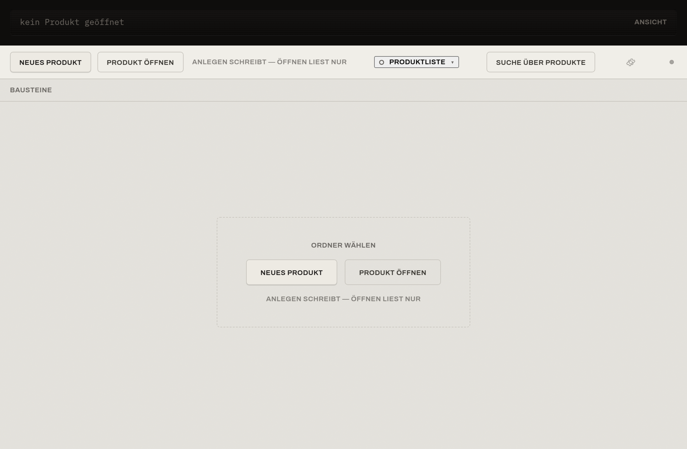
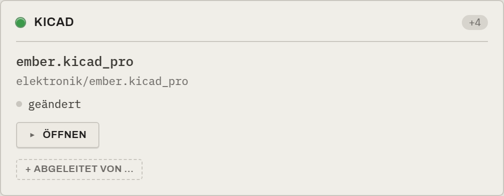

# Erstes Produkt — Schritt für Schritt

Diese Anleitung führt dich vom ersten Start bis zu deinem ersten Meilenstein. Als
durchgehendes Beispiel dient das Produkt **„Ember Reverb"** (ein Effektpedal).

!!! tip "Zwei Wörter, die alles klären"
    Im Werkzeug gilt durchgehend: **anlegen schreibt — öffnen liest nur.** Diese Zeile steht
    auch unter den Knöpfen, damit immer klar ist, was eine Aktion bewirkt.

## Schritt 1 — Programm starten

Nach dem Start zeigt das Werkzeug einen ruhigen Startbildschirm mit zwei Wegen, ein Produkt
zu beginnen:

- **Neues Produkt** — legt ein neues Produkt an (schreibt). Du wählst einen Ordner; das
  Werkzeug richtet ihn als Produkt ein.
- **Produkt öffnen** — öffnet ein bestehendes Produkt (liest nur).
- **Suche über Produkte** — durchsucht alle bekannten Produkte (oben rechts).

## Schritt 2 — Produkt anlegen oder öffnen

=== "Neues Produkt anlegen"

    Klicke **Neues Produkt** und wähle den Ordner, der dein Produkt werden soll. Das Werkzeug
    prüft den Ordner zuerst schonend und richtet ihn dann ein (es legt im Hintergrund die
    Versionierung an und markiert sperrbare Dateitypen).

    !!! note "Bestehende Ordner sind willkommen"
        Du kannst einen Ordner mit vorhandenen Dateien anlegen — das Werkzeug übernimmt sie
        zerstörungsfrei. Nur im seltenen Fall, dass riesige Binärdateien bereits in einer
        Git-Historie stecken, fragt es vorsichtig nach (siehe
        [Git-Ehrlichkeit](../konzepte/git-ehrlichkeit.md)).

=== "Bestehendes Produkt öffnen"

    Klicke **Produkt öffnen** und wähle den Produktordner. Das Werkzeug liest den Ordner ein,
    baut die Werkbank auf und beginnt still, Änderungen zu beobachten.

## Schritt 3 — Werkzeugkasten einrichten

Damit aus deinen Dateien Artefakt-Karten werden, braucht das Produkt einen
**Werkzeugkasten** — die Auswahl der Werkzeuge (Bausteine), mit denen du arbeitest. Hat ein
Produkt noch keinen, lädt dich eine Leiste dazu ein („Werkzeugkasten einrichten"). Du wählst
einen Standard aus der Bibliothek und passt ihn an; das Werkzeug **kopiert** ihn ins Produkt.

Danach zeigt die Leiste ruhig den gewählten Standard und die Zahl der Bausteine, mit einem
dezenten **„erweitern"** für später.

!!! info "Anti-Drift"
    Der Werkzeugkasten ist eine **Kopie**. Spätere Änderungen in der Bibliothek verändern dein
    laufendes Produkt nie — Details unter [Bausteine & Werkzeugkasten](../konzepte/bausteine.md).

## Schritt 4 — Die Werkbank kennenlernen

Jetzt steht die Werkbank. So sieht ein eingerichtetes Produkt aus:

Orientiere dich an den Zonen (ausführlich in der [Oberflächen-Referenz](../referenz/oberflaeche.md)):

1. **Versionsleiste** (oben) — Produkt, Linie, aktive Version, Art.
2. **Einstiegsleiste** — Produkt-Aktionen, der **Raum-Schalter** (Werkbank ↔ Verlauf · Graph),
   die **Produktliste** und das **Zahnrad** (Konto).
3. **Bausteine / Artefakt-Karten** (Mitte) — dein Arbeitszustand, darüber die
   **Sichern / Holen**-Tasten.
4. **Versionsbaum** (rechts, dunkel) — die Historie.
5. **Fremde Sperren & Commits** (ganz rechts) — was Kolleg:innen in Arbeit haben und deine
   jüngsten Sicherungspunkte.

## Schritt 5 — Eine Datei öffnen und bearbeiten

Jede Artefakt-Karte hat eine Ein-Klick-Aktion:

- **öffnen** übergibt die Hauptdatei ans Betriebssystem; sie öffnet sich im Standardprogramm.
- Bei sperrbaren Binärdateien (CAD, Gehäuse) holt das Werkzeug dabei **automatisch die
  Sperre** — die Datei wird für dich beschreibbar, für andere als „gesperrt von dir"
  sichtbar.
- Hat ein Artefakt keine einzelne Hauptdatei (z. B. ein Firmware-Ordner), heißt die Aktion
  **Ordner öffnen**.

Während du arbeitest und speicherst, legt das Werkzeug **still Commits** an — du musst dafür
nichts tun und keine Commit-Nachricht schreiben. Die neuen Commits erscheinen rechts in der
**Commits**-Schiene.

## Schritt 6 — Aufgaben festhalten

Unter den Karten liegt die Aufgaben-Liste. Halte hier fest, was noch zu tun ist:

- **Aufgaben** können später eine Freigabe blockieren.
- **Hinweise** erinnern nur und blockieren nie.

Mehr dazu unter [Aufgaben & Hinweise](../konzepte/aufgaben.md).

## Schritt 7 — Eine Revision setzen

Wenn ein Stand eine echte Version sein soll, erhebst du ihn im Versionsbaum zu einer
**Revision** und gibst ihr einen Namen (z. B. `v0.4`) und eine kurze Zusammenfassung:

- Eine neue Revision ist zunächst ein **Prototyp** (lax, bearbeitbar).
- Schaltest du sie auf **Freigabe**, läuft das **Freigabe-Gate** (offene Punkte werden geprüft)
  und sie wird **schreibgeschützt** — der Stand ist abgeschlossen.
- Aus deiner Zusammenfassung entsteht automatisch eine lesbare `VERSION_NOTES.md` neben
  deinen Dateien.

Die ganze Logik dahinter steht unter [Versionen & Revisionen](../konzepte/versionen.md).

## Schritt 8 — Zwischen den Räumen wechseln

Über den Schalter **„Verlauf · Graph"** oben wechselst du in den vollflächigen Graph-Raum:
Historie filtern, einen alten Stand **als Ordner öffnen**, **von hier abzweigen** oder
(bewusst) **zurückwerfen**. Mit **„Werkbank"** geht es zurück. Details:
[Werkbank & Graph-Raum](../konzepte/werkbank-graph.md).

Hast du mehrere Produkte, wechselst du über die **Produktliste** in der Leiste direkt zu einem
anderen — ohne den Dateidialog.

## Wie geht es weiter?

- Willst du das Produkt im Team nutzen? → [Produkt teilen](teilen.md) (inkl. **Konto** einrichten)
- Unsicher, was ein Bereich oder eine LED bedeutet? → [Die Oberfläche](../referenz/oberflaeche.md)
  und [Status-LEDs](../referenz/status-leds.md)
- Begriff nachschlagen? → [Glossar](../referenz/glossar.md)
