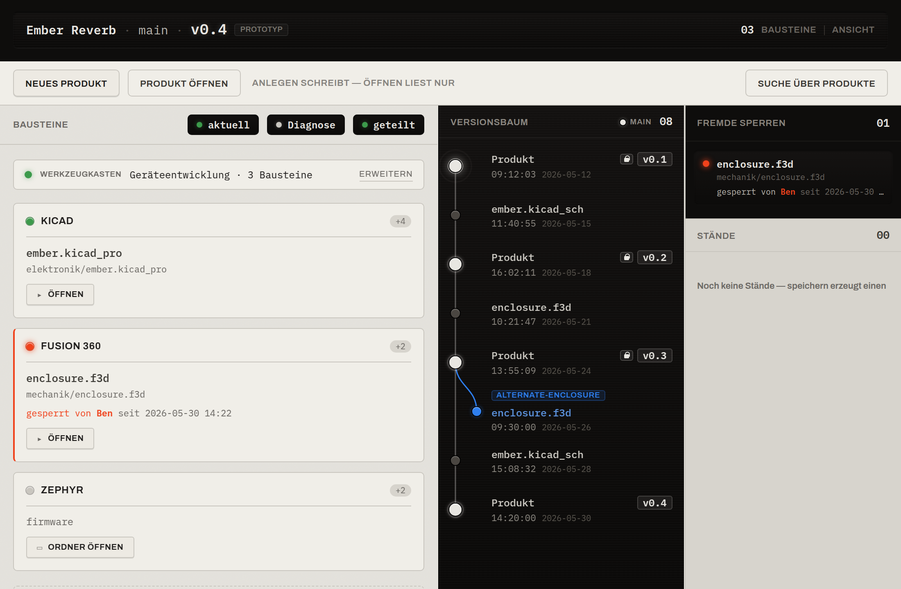

# Werkbank

Ein schlankes, dateibasiertes **Produktdaten-Management** für Einzelentwickler und
kleine Hardware-, Elektronik- und Firmware-Teams.

Das Werkzeug bringt Produktversionen, Entwicklungsdateien und Aufgaben in einer ruhigen,
übersichtlichen Oberfläche zusammen — ohne ein schwergewichtiges Enterprise-PLM zu sein und
ohne dich zu zwingen, in Git zu denken.

## Die Grundidee in drei Sätzen

1. **Deine echten Ordner bleiben die Wahrheit.** Das Werkzeug sitzt *neben* deinen
   Projektordnern auf der Platte, nicht davor. Es erfindet keine zweite Struktur, jede
   Version bleibt auch außerhalb der Software nachvollziehbar.
2. **Eine PLM-Schicht, die ehrlich auf Git läuft.** Speichern erzeugt im Hintergrund still
   einen *Commit*; du benennst nur bewusste *Revisionen* (`v0.4`, `Rev B`). Git-Begriffe
   (Commit, Branch, Push, Pull) dürfen sichtbar sein — versteckt bleibt nur die gefährliche
   Mechanik (Rebase, harte Resets, History umschreiben).
3. **Zusammenarbeit ohne Datenverlust.** Im Team koordiniert das Werkzeug binäre Dateien
   (CAD, Gehäuse, Fotos) über *Sperren*. Du gleichst per **Sichern** und **Holen** ab; nur
   bei einem echten Widerspruch hebt das Werkzeug die Stimme.

## Für wen ist das gedacht?

- Einzelentwickler, Maker und Hardware-Startups
- kleine Entwicklungsteams mit CAD-, Elektronik-, Firmware- und Dokumentationsdateien
- alle, die dateibasiert arbeiten und trotzdem **vollständige, reproduzierbare
  Produktstände** und eine **nachvollziehbare Historie** wollen

!!! note "Lokales Desktop-Programm"
    Die Werkbank ist ein **lokales Desktop-Programm**. Es braucht direkten Zugriff auf
    dein Dateisystem (Dateien beobachten, Programme öffnen, Versionsstände schreiben). Die
    Cloud kommt — wenn überhaupt — nur als *Backup- und Austausch-Remote* ins Spiel, **nie**
    als Dateiablage. Mehr dazu unter [Mehrbenutzer & Sync](konzepte/mehrbenutzer.md).

## Wie du dieses Handbuch liest

-   :material-lightbulb-on: **[Konzepte](konzepte/ueberblick.md)**

    Die Begriffe und Denkweise des Werkzeugs: Produkt, Arbeitsbereich, Baustein,
    Werkbank, Revision, Sperren. Lies das einmal, dann ist der Rest selbsterklärend.

-   :material-rocket-launch: **[Erste Schritte](erste-schritte/erstes-produkt.md)**

    Eine bebilderte Schritt-für-Schritt-Anleitung — vom ersten Öffnen bis zur ersten
    Revision. (Wir nehmen an, dass das Programm bereits installiert ist.)

-   :material-book-open-variant: **[Referenz](referenz/oberflaeche.md)**

    Jeder Bereich der Oberfläche erklärt, die Bedeutung der Status-LEDs und ein
    Glossar zum Nachschlagen.

!!! info "Das Werkzeug wächst noch"
    Einige Funktionen befinden sich aktiv in Entwicklung. Solche Abschnitte sind im
    Handbuch klar als **„in Arbeit"** gekennzeichnet und können sich noch ändern.
