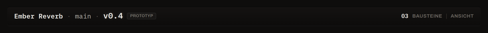

# Produkt, Arbeitsbereich & Artefakt

Das sind die drei tragenden Begriffe für die *Struktur* eines Projekts.

## Produkt

Ein **Produkt** ist die oberste Einheit — in der Regel ein verkaufsfähiges Endprodukt oder
ein übergeordnetes Entwicklungsprojekt. Es entspricht **einem Ordner** auf deiner Platte und
enthält alle Entwicklungsdaten als echte Dateien.

In der Versionsleiste oben siehst du immer, welches Produkt geöffnet ist:



Beispiel im Bild: das Produkt **Ember Reverb**, auf dem Zweig `main`, aktive Version `v0.4`
(ein *Prototyp* — siehe [Versionen & Meilensteine](versionen.md)).

## Arbeitsbereich

Ein **Arbeitsbereich** ist ein echter Ordner *innerhalb* des Produkts — typischerweise eine
Gewerk-Trennung:

```text
ember-reverb/
├── elektronik/      ← Arbeitsbereich
├── mechanik/        ← Arbeitsbereich
├── firmware/        ← Arbeitsbereich
└── dokumentation/   ← Arbeitsbereich
```

Wichtig: Das Werkzeug **spiegelt den echten Ordnerbaum**, es legt keine zweite Struktur
daneben. Daraus folgt eine einfache Regel:

- **Blatt-Ordner** (ohne Unterordner mit eigenen Regeln) tragen einen [Baustein](bausteine.md)
  — hier sitzen die Werkzeug-spezifischen Regeln (z. B. „KiCad lebt in `elektronik/`").
- **Eltern-Ordner** sind reine, regellose Gruppen — kosmetische Gliederung, kein Baustein.

!!! tip "„Module" sind einfach Gruppen-Ordner"
    Ein modulares Produkt (z. B. ein Web-Frontend *und* eine Server-Firmware unter einem
    gemeinsamen `software/`) ist nichts Besonderes: `software/` ist ein regelloser
    Eltern-Ordner, und `software/web/` sowie `software/firmware/` sind zwei Blatt-Ordner mit
    je einem Baustein. Du brauchst kein eigenes „Modul"-Konzept.

## Artefakt

Ein **Artefakt** ist ein logisch verwalteter Bestandteil innerhalb eines Arbeitsbereichs —
z. B. *der Schaltplan*, *das PCB-Layout*, *die BOM*, *das Gehäuse-CAD*.

Ein Artefakt ist **nicht zwingend genau eine Datei**. Es kann eine Datei, mehrere Dateien
oder einen ganzen Ordnerbestandteil umfassen. Das ist wichtig für Programme wie KiCad, bei
denen Projektdatei, Schaltplan und Layout sinnvollerweise im selben Ordner liegen:

```text
elektronik/
├── ember.kicad_pro   ┐
├── ember.kicad_sch   │  zusammen das Artefakt „KiCad-Projekt"
├── ember.kicad_pcb   │
├── sym-lib-table     │
└── fp-lib-table      ┘
```

In der Oberfläche erscheint jedes Artefakt als **Artefakt-Karte** — mit einer *Hauptdatei*,
einem Status-LED und einer Ein-Klick-Aktion zum Öffnen. Wie diese Karten entstehen und wie
du mit ihnen arbeitest, steht unter [Werkbank & Graph-Raum](werkbank-graph.md).

## Datei

Eine **Datei** ist das konkrete Element im Dateisystem. Dateien gehören zu Artefakten,
behalten aber ihren echten Pfad — das Werkzeug versteckt ihn nie. Beim Öffnen übergibt es
den Pfad einfach ans Betriebssystem, das die Datei mit dem **Standardprogramm** öffnet
(`.kicad_pro` → KiCad, `.step` → CAD-Viewer, `.pdf` → PDF-Betrachter, …). Eine eigene
Programmzuordnung pflegt das Werkzeug bewusst nicht.
