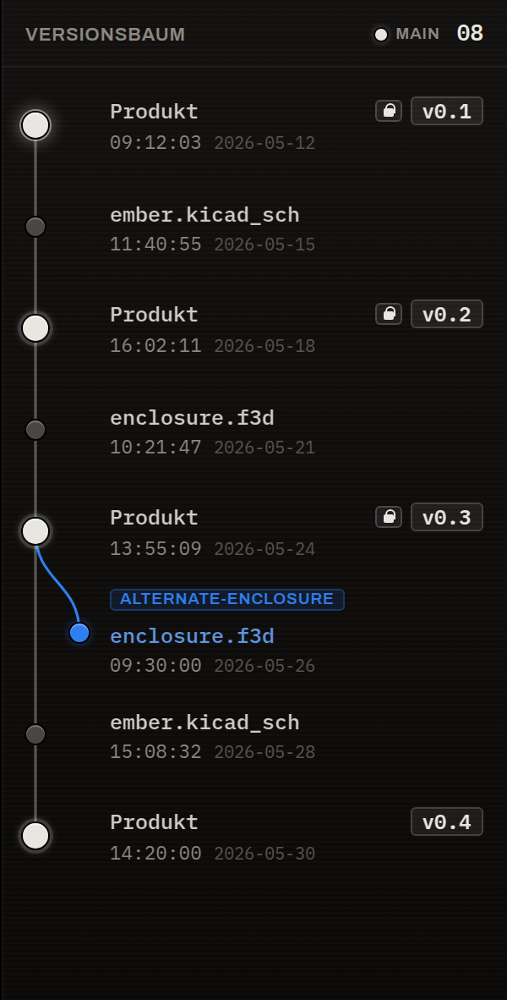

# Versionen & Meilensteine

So denkt das Werkzeug über die Zeit — und warum du nie eine „Commit-Nachricht" schreibst.

## Stand: das stille Speichern

Während du arbeitest, beobachtet das Werkzeug deine Arbeitsbereiche. Wenn sich das Speichern
„beruhigt" hat (kurz nach dem letzten Schreiben, nicht bei jedem Tastendruck), legt es im
Hintergrund **still einen Stand** an. Ein Stand ist ein Sicherungspunkt deiner Arbeit.

Das Entscheidende: Du schreibst dafür **keinen Text**. Die interne Notiz ist maschinell und
langweilig. Frisch angelegte Stände erscheinen rechts in der **Stände**-Schiene und als
Knoten im Versionsbaum.

!!! quote "Stand statt Commit"
    Du siehst **Stände im Graphen**, nie **Commits**. Müsstest du eine Commit-Nachricht
    tippen, wäre das Werkzeug ein Git-Client geworden — genau das soll es nicht sein.
    Menschlicher Text entsteht nur einmal: am Meilenstein.

## Meilenstein: der benannte Stand

Ein **Meilenstein** ist ein Stand, den du bewusst zu einer **benannten Version** erhebst
(z. B. `v0.4`, `Rev B`, `Prototyp 1`). Beim Erheben schreibst du eine kurze
Zusammenfassung — das ist der Moment für menschlichen Text. Daraus erzeugt das Werkzeug
automatisch eine lesbare `VERSION_NOTES.md` neben deinen Dateien.

Im Versionsbaum sind Meilensteine als helle Knoten mit ihrem Versionsetikett markiert:

### Zwei Arten von Meilenstein

Ein Meilenstein hat eine **Art**, die seine Strenge bestimmt:

| Art | Bedeutung | Verhalten |
|---|---|---|
| **Prototyp** | lockerer Zwischenstand | bearbeitbar, lax — der Standard für einen neuen Meilenstein |
| **Freigabe** | abgeschlossener, geprüfter Stand | **schreibgeschützt**; bewusst und umkehrbar umschaltbar |

Eine **Freigabe** liest sich in der Versionsleiste ruhig und gedämpft als
„Freigabe · schreibgeschützt" — bewusst **nicht** orange, denn das Umschalten ist ein
überlegter Akt, keine laute Ausnahme. Im Beispiel oben ist `v0.4` ein *Prototyp*: noch in
Arbeit.

!!! note "Schreibschutz schützt vor Versehen"
    Eine freigegebene Version ist schreibgeschützt. Willst du daran weiterarbeiten, entsteht
    bewusst ein neuer Stand bzw. ein neuer Zweig — abgeschlossene Stände bleiben so vor
    versehentlichen Änderungen geschützt.

## Freigabe-Dialog: ein Knopf, der seine Bedeutung wechselt

Wenn du einen Meilenstein zur **Freigabe** machst, sammelt das Werkzeug die offenen Punkte
(offene Aufgaben, veraltete Ableitungen, Waisen) in **einer** nach Härte sortierten Liste,
mit **einem** kontextabhängigen Knopf:

- **alles sauber** → der Knopf heißt schlicht *Taggen* (Freigeben);
- **harter Block** → der Knopf ist aus; daneben steht die blockierende Aufgabe selbst
  (Erledigen / Verwerfen / Herabstufen);
- **weicher Block** → *Trotzdem freigeben* mit einem protokollierten Begründungssatz;
- **Warnung** (z. B. veraltete Ableitung) → sichtbar oben, ohne den Knopf zu sperren.

Die `VERSION_NOTES.md` ist dabei **Ergebnis** der Freigabe, keine Vorbedingung: dein
Zusammenfassungs-Text ist die Eingabe, das Taggen erzeugt die Datei.

!!! info "In Arbeit"
    Der vollständige dreistufige Freigabe-Gate (harter/weicher Block, Eskalationswege) wird
    gerade implementiert. Das Modell — *Prototyp vs. Freigabe*, Strenge an der Meilenstein-Art
    — ist stabil.

## Zweige & Versionsnummern

Ein **Zweig** ist ein bewusster Entwicklungszweig für Varianten oder Experimente (im Bild
oben: `alternate-enclosure`). Eine Version wird eindeutig durch **Produkt + Zweig +
Versionsname** identifiziert — darum zeigt die Versionsleiste beides immer zusammen.

Versionsnamen schlägt das Werkzeug vor, erzwingt aber kein Schema: `v0.1`, `v1.0`, `Rev A`,
`Prototype 1`, `Serie 2026-01` sind alle erlaubt.

!!! info "In Arbeit"
    Das Anlegen, Zusammenführen und Landen von Zweigen direkt in der App wird gerade
    ausgebaut.
