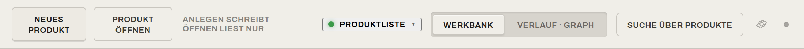
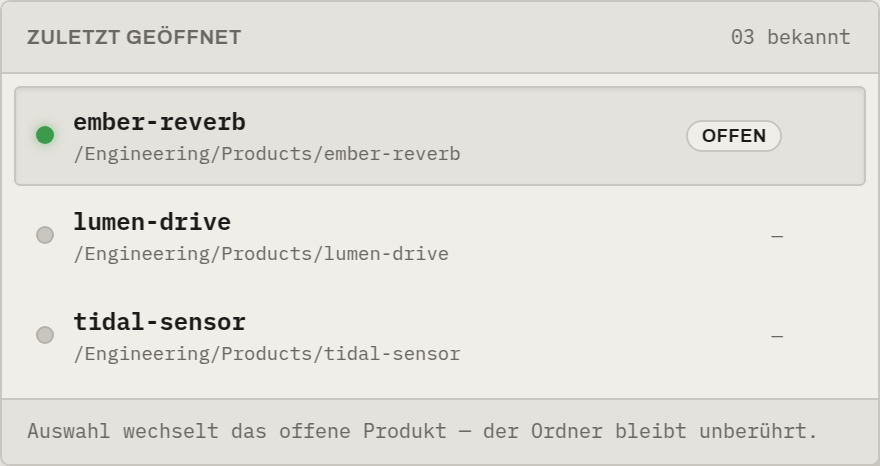
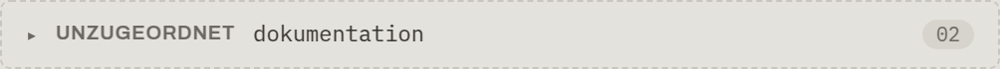
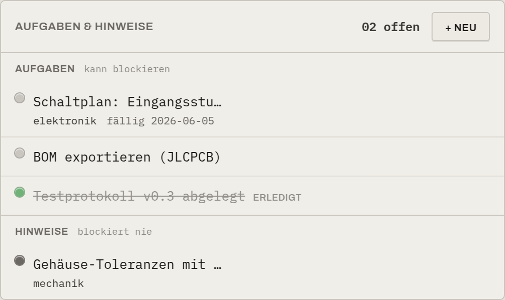
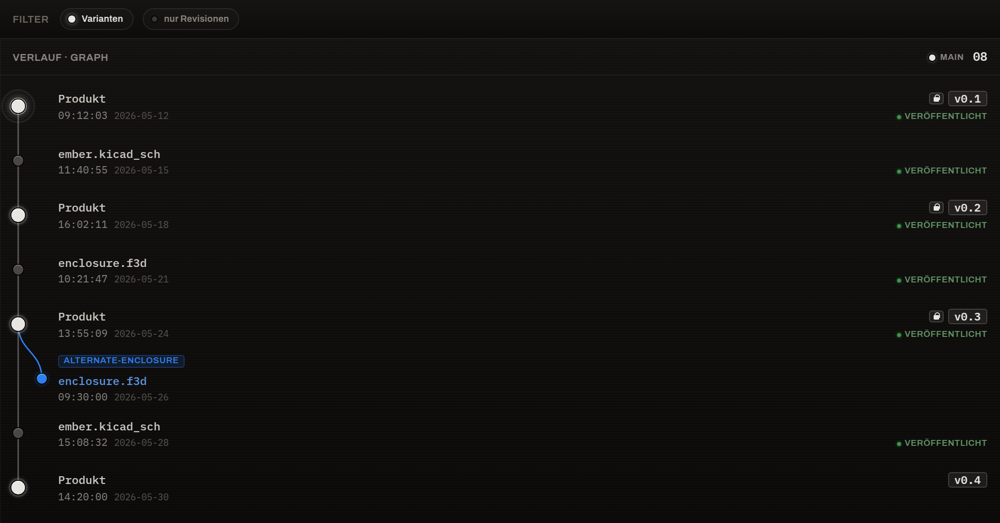
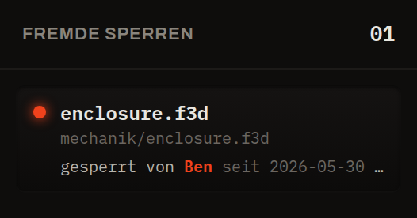

# Die Oberfläche

Ein geöffnetes Produkt teilt sich in klar getrennte Zonen. Dieses Bild dient als Landkarte:

## 1. Versionsleiste (oben, dunkel)

Das „Display" des Geräts. Es zeigt auf einen Blick:

- **Produktname** · **Linie** · **aktive Version** (z. B. `Ember Reverb · main · v0.4`),
- die **Art** der aktiven Revision (`Prototyp` lax / `Freigabe · schreibgeschützt`),
- rechts die Zahl der **Bausteine** und den Zugang zur **Ansicht**.

Ist noch keine Revision gesetzt, steht hier ehrlich `— keine Revision —`.

## 2. Einstiegsleiste

Hier liegen die produktübergreifenden Bedienelemente:

- **Neues Produkt** / **Produkt öffnen** — anlegen (schreibt) bzw. öffnen (liest nur). Die
  Merkzeile *„anlegen schreibt — öffnen liest nur"* hält den Unterschied präsent.
- **Produktliste** — ein Klappmenü „Zuletzt geöffnet" zum direkten Wechseln des offenen
  Produkts (siehe unten).
- **Raum-Schalter** — **Werkbank** (Jetzt) ↔ **Verlauf · Graph** (Historie).
- **Suche über Produkte** — durchsucht alle bekannten Produkte.
- **Zahnrad (Einstellungen)** — öffnet das [Konto](../erste-schritte/teilen.md#das-konto-app-weite-server-identitat).
- **Diagnose** — eine kleine, unauffällige Lampe, die das Sync-/Sicherungs-Protokoll
  ein- und ausblendet.

### Produktliste / Verlauf

Zeigt die bekannten Produkte mit ihrem Pfad und wann sie zuletzt offen waren. Das aktuell
offene trägt **„offen"**. Eine Auswahl **wechselt das offene Produkt — der Ordner bleibt
unberührt**. Mit dem ✕ entfernst du einen Eintrag aus der Liste (auch hier bleibt der Ordner
unangetastet).

## 3. Sync-Leiste & Bausteine

Über den Karten liegen die manuellen Sync-Tasten und der Alltags-Status:

- **Sichern** (↑) — persönliches Backup deiner Arbeit (erreicht nie den geteilten Stand).
- **Holen** (↓) — den geteilten Stand der Kolleg:innen hereinholen.
- **Statuszeile** — entweder **„{Name} arbeitet an {Datei}"** oder **„aktuell" / „gesichert"**.

Details: [Mehrbenutzer & Sync](../konzepte/mehrbenutzer.md).

## 4. Artefakt-Karten (Mitte)

Der Arbeitszustand als Karten je Arbeitsbereich. Jede Karte trägt einen
[Status-LED](status-leds.md), den Bausteinnamen, die Hauptdatei mit echtem Pfad, einen
abgeleiteten Status (`geändert`, `fehlt`, `veraltet?` …) und die Ein-Klick-Aktion **öffnen** /
**Ordner öffnen**.

Darunter sammeln sich nicht zugeordnete Dateien im **Unzugeordnet-Fach**:

## 5. Aufgaben & Hinweise

Unter den Karten liegt die Aufgaben-Liste des Produkts — Aufgaben (können blockieren) und
Hinweise (blockieren nie). Siehe [Aufgaben & Hinweise](../konzepte/aufgaben.md).

## 6. Versionsbaum (rechts, dunkel)

Die Historie als „Display"-Zone: Commits und benannte Revisionen, abzweigende Varianten (im
Bild blau) und die aktive Linie. Veröffentlichte Stände tragen ein **„veröffentlicht"**-
Abzeichen. Reine Orientierung — ein Klick verschiebt nie still deine Werkbank.

Für die vollflächige Ansicht mit Filtern und den drei Knoten-Verben wechselst du über
**„Verlauf · Graph"** in den [Graph-Raum](../konzepte/werkbank-graph.md#der-graph-raum-verlauf):

## 7. Fremde Sperren & Commits (ganz rechts)

- **Fremde Sperren** — welche Binärdateien Kolleg:innen gerade in Arbeit haben
  („gesperrt von X seit …").
- **Commits** — deine jüngsten stillen Sicherungspunkte, neueste zuerst.

## Bewegung & Ton

Die Oberfläche ist im Alltag **leise**: schnelle, unaufdringliche Übergänge, kein Blinken.
Laut wird sie nur an der einen Stelle, an der sie es sein muss — der
[lauten Ausnahme](../konzepte/mehrbenutzer.md#die-laute-ausnahme) beim Holen oder
Veröffentlichen. Dort, und nur dort, hebt ein oranger Rahmen kurz die Stimme.

## Spalten anpassen

Versionsbaum und die rechte Schiene lassen sich an ihren Trennlinien in der Breite ziehen;
die Werkbank füllt den Rest. Die eingestellten Breiten merkt sich das Werkzeug pro Produkt.
